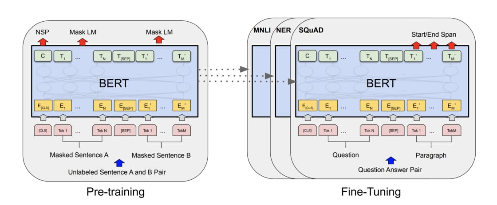

# [醫病訊息決策與對話語料分析競賽](https://aidea-web.tw/aicup_meddialog)
## [秋季賽：醫病資料去識別化](https://aidea-web.tw/aicup_meddialog)
### BERT Named Entity Recognition

Named entities are phrases that contain the names of persons, organizations, locations, times and quantities.

There are 13 entity tags in this task:
* location
* education
* clinical_event
* familyO	[CLS]
O	The
B-ORG	European
I-ORG	Commission
O	said
O	on
O	Thursday
O	it
O	disagreed
O	with
B-MISC	German
* money
* profession
* others
* organization
* time
* name
* ID
* contact
* med_exam

#### For example:
```
article_id	start_position	end_position	entity_text	entity_type
0	  55	   57      68           med_exam
0	  66	   68      68  	        med_exam
0	  1264	   1271	   10.78公分	    med_exam
0	  1358	   1361	   三多路	    location
0	  1374	   1378	   長庚醫院	    location
0	  1863	   1865	   十天	        time
0	  2072	   2076	   打撲克牌	    profession
0	  2575	   2578	   四五天	    time
0	  2604	   2609	   3月18號	    time
0	  2630	   2635	   3月24日	    time
0	  2650	   2654	   3月24	        time
0	  2663	   2666	   禮拜二	    time
0	  2667	   2670	   禮拜四	    time
0	  2692	   2697	   3月31日	    time
1	  527	   531	   奇美醫院	    location
1	  802	   805	   三個月	    time
1	  904	   910	   五十二百分比	med_exam
1	  915	   921	   五十二百分比	med_exam
1	  933	   936	   陳醫師	    name
1	  988	   992	   兩百多萬	    money
1	  997	   1001	   兩百多萬	    money
1	  1021	   1025	   兩百多萬	    money
1	  1052	   1055	   五個月	    time
1	  1382	   1387	   二零一六年	    time
1	  1394	   1396	   四年	        time
1	  1404	   1406	   四年	        time
1	  1414	   1416	   四年	        time
1	  2259	   2263	   一個半月	    time
1	  2295	   2299	   兩個禮拜	    time
1	  2334	   2338	   三個禮拜	    time
1	  2404	   2407	   陳醫師	    name
```
#### Evaluate the trained NER model based on BERT
```
article_id	start_position	end_position	entity_text	entity_type
0	  198	    200	    新樓	     location
0	  295	    297	    今年	     time
1	  31	    32   	今	     time
1	  40	    42   	昨天	     time
1	  76	    80	    0.79	 med_exam
1	  94	    96	    88	     med_exam
1	  111	    113	    60	     med_exam
1	  122	    124	    60	     med_exam
1	  179	    181	    20	     med_exam
1	  182	    184	    19	     med_exam
1	  258	    261	    2.6	     med_exam
1	  360	    363	    黃醫師	 name
1	  366	    369	    6.6	     med_exam
1	  385	    388	    6.6	     med_exam
1	  394	    397	    8.3	     med_exam
1	  407	    410	    8.3	     med_exam
1	  414	    417	    四個月	 time
1	  418	    421	    8.3	     med_exam
1	  463	    466	    6.2	     med_exam
1	  469	    472	    三個月	 time
1	  497	    500	    劉老師	 name
1	  625	    629	    藥黃醫師	 name
1	  742	    744	    中午	     time
1	  867	    869	    21	     med_exam
1	  873	    875	    21	     med_exam
1	  881	    884	    12天	     time
1	  890	    893	    12天	     time
1	  902	    906	    三個星期	 time
```




#### See also

* [Transformer](https://youtu.be/ugWDIIOHtPA)
* [ELMO, BERT, GPT2](https://youtu.be/UYPa347-DdE)
